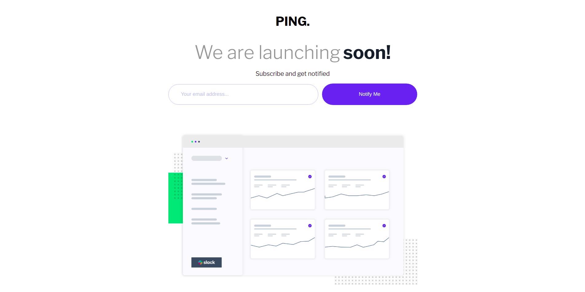

# Frontend Mentor - Ping coming soon page

## Welcome! 👋

Thanks for checking out this front-end coding challenge.

[Frontend Mentor](https://www.frontendmentor.io) challenges help you improve your coding skills by building realistic projects.

## Overview

## The challenge

Your challenge is to build out this Coming Soon page and get it looking as close to the design as possible.

You can use any tools you like to help you complete the challenge. So if you've got something you'd like to practice, feel free to give it a go.

Your users should be able to:

- View the optimal layout for the site depending on their device's screen size
- See hover states for all interactive elements on the page
- Submit their email address using an `input` field
- Receive an error message when the `form` is submitted if:
  - The `input` field is empty. The message for this error should say _"Whoops! It looks like you forgot to add your email"_
  - The email address is not formatted correctly (i.e. a correct email address should have this structure: `name@host.tld`). The message for this error should say _"Please provide a valid email address"_

### Links

- Solution URL: [repo](https://github.com/AlecANL/ping-coming-soon-page)
- Live Site URL: [live demo](https://alec-portfolio-dev.vercel.app/)

## My process

### Built with

- Semantic HTML5 markup
- CSS custom properties
- Flexbox
- CSS Grid
- Mobile-first workflow

## Author

- Website - [alec's portfolio](https://www.your-site.com)
- Frontend Mentor - [@ALecANL](https://www.frontendmentor.io/profile/yourusername)
- Twitter - [@alexei_alvarez4](https://www.twitter.com/alexei_alvarez4)
